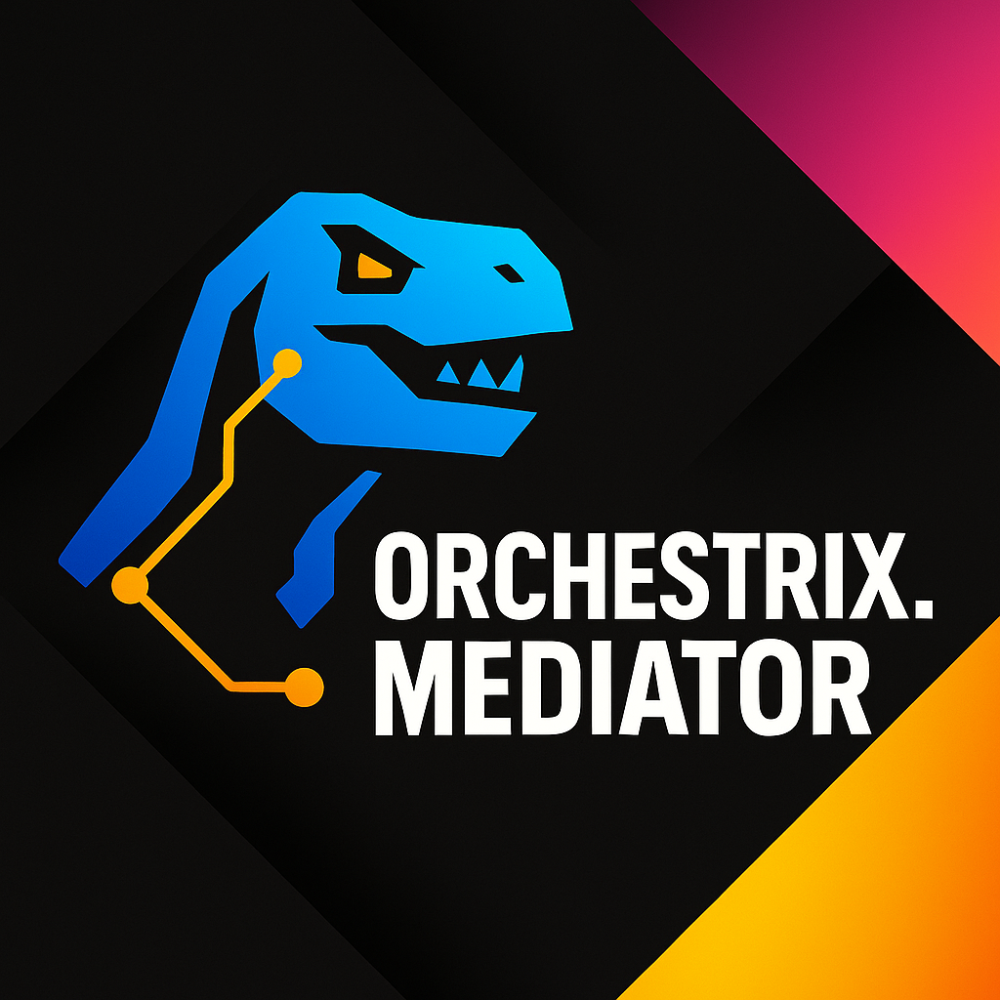

<p align="center">
  
</p>

# 🦖 Orchestrix.Mediator

Modern, extensible, and production-grade mediator engine for .NET 8+  
With parallel notifications, streaming, pipelines, source generators, and full CQRS support via extensions.

## ✨ Why Orchestrix.Mediator?

Orchestrix.Mediator is a complete rethinking of a mediator engine for the modern .NET ecosystem.

✅ Reflection-based dispatch by default  
🧬 Source generator dispatch (opt-in)  
📢 Sequential & parallel notifications  
📡 Streaming request handling (`IAsyncEnumerable<T>`)  
🧱 Fully pluggable via pipelines and diagnostics hooks  
🧩 CQRS-style `ICommand`, `IQuery`, and handler support (extension)  
🔧 Minimal API & Controller friendly  
🧪 Built for performance and testability

---

Full Documentation: [Orchestrix.Mediator Docs →](https://github.com/anzawi/Orchestrix.Mediator/blob/main/docs/01-GettingStarted.md)

---

## 📦 Installation

```bash
dotnet add package Orchestrix.Mediator
```

**Optional Extensions**

```bash
# Optional: Source generator-based dispatch
dotnet add package Orchestrix.Mediator.SourceGenerators

# Optional: CQRS abstractions (ICommand, IQuery, etc.)
dotnet add package Orchestrix.Mediator.Cqrs
```

---

## 🧰 Basic Example – Core Only

**🧾 Define a request, notification, and handlers:**

```csharp
public record TestCommand(string? Name, string? Surname, string? Email, string? Phone) : IRequest<string>;

public class TestCommandHandler(IPublisher publisher) : IRequestHandler<TestCommand, string>
{
    public async ValueTask<string> Handle(TestCommand request, CancellationToken cancellationToken)
    {
        Console.WriteLine($"Hello {request.Name} {request.Surname} {request.Email} {request.Phone}");
        
        await publisher.Publish(new TestNotification(request.Name), cancellationToken);
        return "OK";
    }
}

public record TestNotification(string? Name) : INotification;

public class LogTestNotificationHandler : INotificationHandler<TestNotification>
{
    public ValueTask Handle(TestNotification notification, CancellationToken cancellationToken)
    {
        Console.WriteLine($"[Generic Handler] Logging TestNotification: {notification.Name}");
        return default;
    }
}

public class ParallelTestNotificationHandler : IParallelNotificationHandler<TestNotification>
{
    public async ValueTask Handle(TestNotification notification, CancellationToken cancellationToken)
    {
        Console.WriteLine($"[Parallel Handler] Simulating async work for {notification.Name}");
        await Task.Delay(300, cancellationToken);
    }
}
```

---

## ⚙️ Minimal API / Controller Example

```csharp
[HttpGet]
public async Task<IActionResult> Test([FromServices] ISender sender)
{
    var command = new TestCommand("Mohammad", "Anzawi", "anzawi@test.com", "00000");
    var result = await sender.Send(command, CancellationToken.None);
    return Ok(result);
}
```

---

## 🔧 Configuration

**Default (Reflection-based):**

```csharp
services.AddOrchestrix(assemblies: [typeof(TestCommandHandler).Assembly]);
```

**Enable Source Generator (opt-in):**

```csharp
services.AddOrchestrix(options =>
{
    options.MediatorMode = MediatorMode.SourceGenerator;
}, assemblies: [typeof(TestCommandHandler).Assembly]);
```

---

## 🧬 Dispatch Modes

| Mode               | Description                     |
|--------------------|---------------------------------|
| 🪞 Reflection      | Resolves via `IServiceProvider` |
| ⚡ Source Generator | Compile-time dispatch, AOT safe |

Source generators eliminate runtime lookup and boost performance.  
See **Source Generators** →

---

## ✅ Core Interfaces

| Interface                                                    | Role                             |
|--------------------------------------------------------------|----------------------------------|
| `IRequest`, `IRequest<T>`                                    | Request contracts                |
| `INotification`                                              | Fire-and-forget events           |
| `ISender`, `IPublisher`, `IMediator`                         | Dispatch interfaces              |
| `IRequestHandler<T>`, `IRequestHandler<T, R>`                | Request handlers                 |
| `INotificationHandler<T>`, `IParallelNotificationHandler<T>` | Event handlers                   |
| `IStreamRequest<T>`, `IStreamRequestHandler<T, R>`           | Async streaming support          |
| `IPipelineBehavior<T, R>`                                    | Pipeline behaviors               |
| `VoidMarker` (internal) | Used internally to support `IRequest` (non-generic) in source-generated dispatch |

---

## 🧠 Diagnostics & Hooks

| Interface                                  | Role                         |
|--------------------------------------------|------------------------------|
| `ISendHook`, `IPublishHook`, `IStreamHook` | Lifecycle instrumentation    |
| `IHookExecutor`, `HookConfiguration`       | Hook orchestration & control |

Enable diagnostics, logging, tracing, or global behaviors with zero impact on business logic.  
See **Hooks & Pipelines** →

---

## 🧭 CQRS Extension

**Install:**

```bash
dotnet add package Orchestrix.Mediator.Cqrs
```

**Adds:**

```csharp
// Marker interfaces
ICommand, ICommand<TResponse>
IQuery<TResponse>

// Handlers
ICommandHandler<T>, ICommandHandler<T, R>
IQueryHandler<T, R>
```

**Supports both:**

```csharp
public class SaveCommand : ICommand;         // No return
public class SaveCommand : ICommand<Unit>;   // Explicit unit
```

See **CQRS Guide** →

---

## 📚 Documentation Index
Full Documentation: [Orchestrix.Mediator Docs →](https://github.com/anzawi/Orchestrix.Mediator/blob/main/docs/01-GettingStarted.md)

| Topic                                                                                                        | Description                       |
|--------------------------------------------------------------------------------------------------------------|-----------------------------------|
| 🏁 [Getting Started](https://github.com/anzawi/Orchestrix.Mediator/blob/main/docs/01-GettingStarted.md)      | Install, configure, send, publish |
| 🧠 [Core Concepts](https://github.com/anzawi/Orchestrix.Mediator/blob/main/docs/02-CoreConcepts.md)          | Interfaces, dispatcher roles      |
| 🧭 [CQRS Guide](https://github.com/anzawi/Orchestrix.Mediator/blob/main/docs/03-CqrsGuide.md)                | `ICommand`, `IQuery`, etc.        |
| ✨ [Source Generators](https://github.com/anzawi/Orchestrix.Mediator/blob/main/docs/04-SourceGenerators.md)   | Compile-time dispatching          |
| 🪝 [Hooks & Pipelines](https://github.com/anzawi/Orchestrix.Mediator/blob/main/docs/05-HooksAndPipelines.md) | Diagnostics + middleware          |
| 📡 [Streaming](https://github.com/anzawi/Orchestrix.Mediator/blob/main/docs/06-Streaming.md)                 | Streaming requests                |
| 📢 [Notifications](https://github.com/anzawi/Orchestrix.Mediator/blob/main/docs/07-Notifications.md)         | Publish, parallelism              |
| 🔍 [Diagnostics](https://github.com/anzawi/Orchestrix.Mediator/blob/main/docs/08-Diagnostics.md)             | Tracing, hook config              |
| 🌀 [Sagas Guide](https://github.com/anzawi/Orchestrix.Mediator/blob/main/docs/11-sagas.md)                   | Add in-process Sagas              |
| 🧙 [Advanced Usage](https://github.com/anzawi/Orchestrix.Mediator/blob/main/docs/09-AdvancedUsage.md)        | `TrySend`, `TryPublish`, fallback |
| 📖 [API Reference](https://github.com/anzawi/Orchestrix.Mediator/blob/main/docs/09-AdvancedUsage.md)         | Interface + type index            |
| ❓ [FAQ](https://github.com/anzawi/Orchestrix.Mediator/blob/main/docs/10-FAQ.md)                              | Answers to common Qs              |
| 🔁 [Migration Guide](https://github.com/anzawi/Orchestrix.Mediator/blob/main/docs/MIGRATIONFromMediatR.md)   | From MediatR to Orchestrix        |

---

## 🔁 Migrating from MediatR?

See **MIGRATION.md**

- Swap `IMediator` to `ISender` and `IPublisher`
- Replace `IRequestHandler<>` with `ICommandHandler<>` / `IQueryHandler<>`
- Replace `INotificationHandler<>` with `IParallelNotificationHandler<>` if parallel behavior is needed
- Enable `MediatorMode.SourceGenerator` for performance
- Use `Dispatch`, `DispatchVoid`, `TrySend`, `TryPublish`, etc.

---

## 🚀 Performance-Ready

⚡ Zero-reflection dispatch via source generators  
🧵 True parallel notifications  
✅ `ValueTask` everywhere  
🧬 NativeAOT-friendly  
🔧 Small, fast, testable core

---

## 📜 License

MIT — free for personal and commercial use.

---

## 🙏 Acknowledgements

Inspired by MediatR  
Rebuilt from scratch for modern .NET by **@Mohammad_Anzawi**  
Proudly open-source and forever free

🦖 **Orchestrix.Mediator**: Mediation, Modernized.
